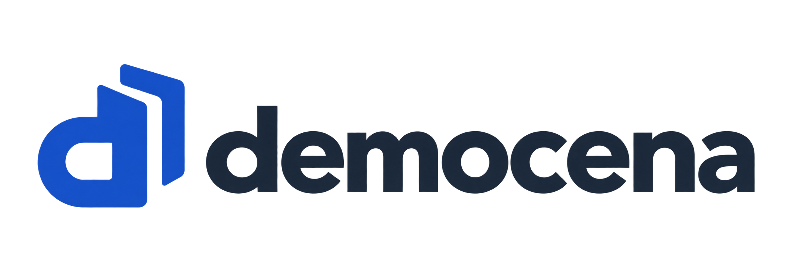
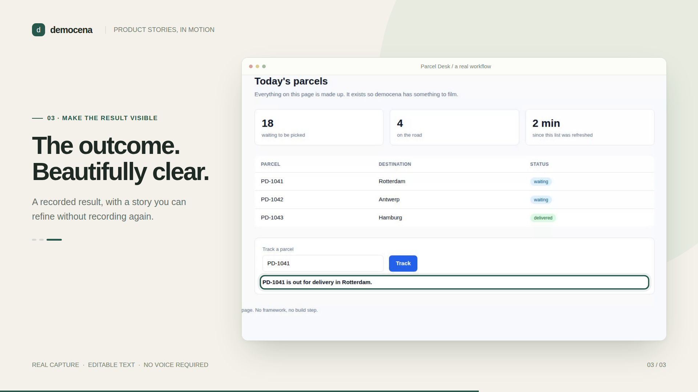

<h1 align="center">
  
</h1>

<p align="center"><strong>Real product workflows. Text that guides. Motion that makes them clear.</strong></p>

Democena records scripted browser walkthroughs and turns them into silent product demos, GIFs, and documentation images.

**Status: early alpha.** The optional `studio/` adds eight scene types: animated text, chapter breaks, app overview, spotlight focus, camera paths, paused annotations, before/after results, and closing panels. It is a developer tool, not a hosted editor.



## Start locally

Node 22.12+, npm, FFmpeg, and Chromium's system dependencies are required.

```bash
git clone https://github.com/andrewsrigom/democena.git
cd democena
npm ci --ignore-scripts
npx playwright install chromium
npm run build
node dist/cli/index.js --help
npm run example
```

The example is **Forma**, an original, synthetic collection app: add a product, publish the collection and open its public catalog. It runs on localhost with no account, API key or external model. Forma and the motion presentation share a CatalogForge-inspired blue palette, white panels and restrained borders.

## Try the Remotion prototype

```bash
npm run studio:install
npm run studio:capture
npm run studio:render
npm run studio:dev
```

Capture produces a clean browser video plus an editable scene manifest. Render creates `studio/output/democena.mp4`. Studio previews the same composition. Change the text, accent, project branding and focus points in `studio/project.json`, then render again without replaying the application. Generated projects have no Democena watermark; add a name, tagline, footer or imported logo only when the demo needs them.

Each scene has its own duration and transition. Freeze the recording for an explanation, move between real elements, or compare two recorded states. `npm run studio:preview` exports a still of every scene.

See the [scene authoring guide](docs/scenes.md) and [studio/README.md](studio/README.md) for controls, examples and current limits.

## Capture your application

The local package has not been published to npm. Install this checkout into your application, then initialize it:

```bash
npm install --save-dev /absolute/path/to/democena
npx democena init
npx democena agent-guide
```

Write `democena.config.ts` and a scenario that imports `test` and `expect` from `democena`. CLI environment variables use the `DEMOCENA_` prefix.

```bash
npx democena check --json
npx democena video
npx democena images 3
```

The core CLI still renders its in-page overlays. The clean-capture Remotion prototype uses a shared declarative browser-capture engine; it does not yet convert every existing scenario automatically.

## Use with Codex or another agent

The optional local MCP server exposes browser capture, project discovery, scene editing, media import, validation, background rendering and PNG previews. The same operations are available through a JSON CLI for agents with terminal access.

```bash
npm run mcp:install
npm run mcp:build
node mcp/dist/mcp/src/cli.js capabilities --workspace "$PWD/.democena-agent"
```

Configure Codex to launch `mcp/dist/mcp/src/index.js` with an explicit workspace. See the [agent and MCP guide](docs/agents.md) for setup and the complete capture → inspect → compose → preview → render workflow. Capture jobs return real action timestamps, measured element rectangles and screenshots; adopting a take preserves existing scene edits.

## Development

```bash
npm run typecheck
npm test
npm run build
npm run test:browser
npm run test:capture
npm --prefix studio run typecheck
```

[Architecture and next steps](docs/architecture.md) · [Writing a scenario](docs/writing-a-scenario.md)

## License and attribution

Licensed under [Apache-2.0](LICENSE). Based on [Demotale](https://github.com/pesuto-dev/demotale); see [NOTICE](NOTICE) for credits and [UPSTREAM.md](UPSTREAM.md) for origin and changes.

Remotion and browser/media dependencies retain their own licenses. In particular, Remotion has [its own license](https://www.remotion.dev/license); this repository does not relicense it under Apache-2.0.
